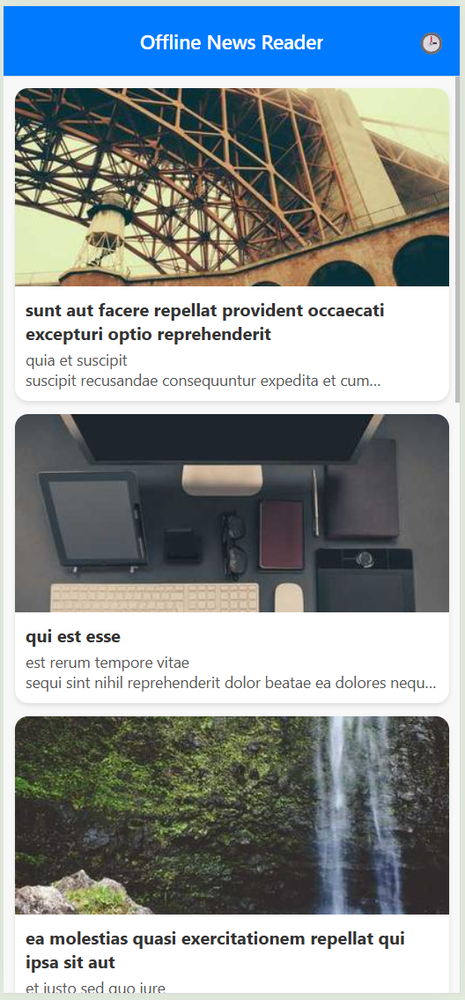
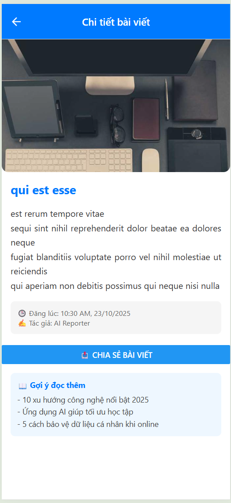
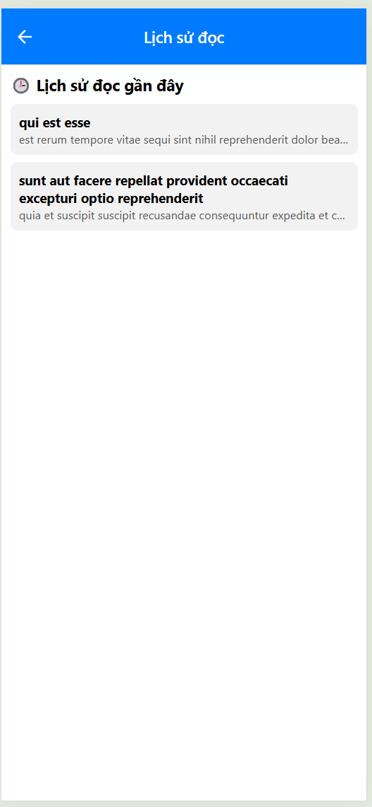

# Welcome to your Expo app 👋
# 📰 OFFLINE NEWS READER  
Ứng dụng đọc tin tức **Offline** được xây dựng bằng **React Native (Expo)**.  
Hỗ trợ **cache dữ liệu**, **chế độ offline**, và **chia sẻ bài viết** trên cả **Web và Mobile**. 

## 🚀 MỤC TIÊU ĐỀ TÀI

**Đề số 4 – Offline News Reader**  
> Xem tin tức từ API, hỗ trợ cache offline, hiển thị khi không có mạng.




### 🎯 Yêu cầu tối thiểu:
- Khi online: fetch dữ liệu từ API, lưu cache.  
- Khi offline: hiển thị dữ liệu từ cache, báo “Offline mode”.  
- Màn hình chi tiết hiển thị nội dung bài viết.

## 🧩 TÍNH NĂNG CHÍNH

✅ **Đọc tin tức online & offline**  
- Lấy dữ liệu từ API khi có mạng.  
- Khi mất kết nối, hiển thị dữ liệu cache từ AsyncStorage.  

✅ **Làm mới (Pull to Refresh)**  
- Vuốt xuống để tải lại tin mới và cập nhật cache.  

✅ **Lưu lịch sử bài viết đã xem**  
- Ghi nhớ các bài viết đọc gần đây, lưu tối đa 20 bài.  

✅ **Chia sẻ bài viết (Share)**  
- Tự động nhận biết nền tảng:
  - **Web:** sử dụng `navigator.share()`  
  - **Mobile:** sử dụng `expo-sharing` hoặc `Share` API  

✅ **UI thân thiện, Responsive**  
- Sử dụng `FlatList` + `ScrollView`  
- Thiết kế gọn gàng, hiển thị ảnh, tiêu đề, nội dung ngắn gọn.  

## 🏗️ CẤU TRÚC THƯ MỤC
offline-news-reader/
│
├── app/
│ ├── _layout.js # Root stack navigation
│ └── index.js # Trang chính (Home)
│
├── screens/
│ ├── HomeScreen.js # Danh sách tin tức
│ ├── DetailScreen.js # Chi tiết bài viết + chia sẻ
│ └── HistoryScreen.js # Lịch sử xem tin tức
│
├── utils/
│ └── shareNews.js # Hàm chia sẻ đa nền tảng
│
├── components/ # Các component phụ (nếu có)
├── assets/ # Hình ảnh hoặc icon
│
├── App.js
├── package.json
├── README.md


---------------------------------------------------------------
---------------------------------------------------------------
## Get started

1. Cài dependencies

   ```bash
   npm install
   ```

2. Cài Expo CLI (nếu chưa có)
   ```bash
   npm install -g expo-cli
   ```

3. cài đặt thư viện
   ```bash
   npx expo install expo-sharing expo-file-system @react-native-async-storage/async-storage @react-native-community/netinfo
   ```

4. Chạy ứng dụng

   ```bash
   npx expo start
   ```
   Nhấn w để chạy trên web
   Nhấn a để chạy trên Android (Expo Go)
   Nhấn i để chạy trên iOS (Mac)
   
   In the output, you'll find options to open the app in a

   - [development build](https://docs.expo.dev/develop/development-builds/introduction/)
   - [Android emulator](https://docs.expo.dev/workflow/android-studio-emulator/)
   - [iOS simulator](https://docs.expo.dev/workflow/ios-simulator/)
   - [Expo Go](https://expo.dev/go), a limited sandbox for trying out app development with Expo

   You can start developing by editing the files inside the **app** directory. This project uses [file-based routing](https://docs.expo.dev/router/introduction).

## Get a fresh project

When you're ready, run:

```bash
npm run reset-project
```

This command will move the starter code to the **app-example** directory and create a blank **app** directory where you can start developing.

## Learn more

To learn more about developing your project with Expo, look at the following resources:

- [Expo documentation](https://docs.expo.dev/): Learn fundamentals, or go into advanced topics with our [guides](https://docs.expo.dev/guides).
- [Learn Expo tutorial](https://docs.expo.dev/tutorial/introduction/): Follow a step-by-step tutorial where you'll create a project that runs on Android, iOS, and the web.

## Join the community

Join our community of developers creating universal apps.

- [Expo on GitHub](https://github.com/expo/expo): View our open source platform and contribute.
- [Discord community](https://chat.expo.dev): Chat with Expo users and ask questions.
